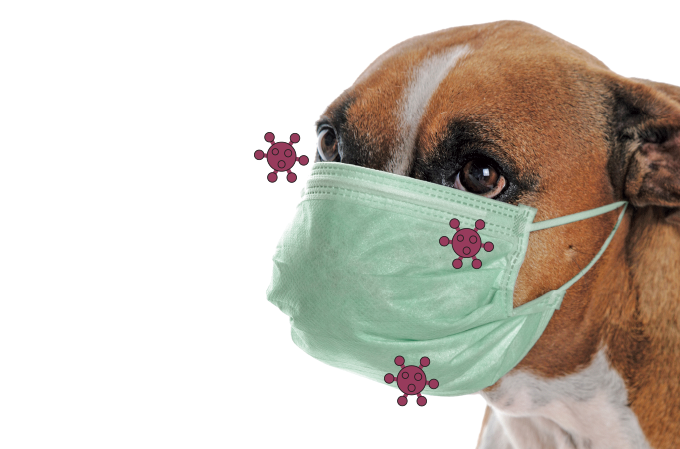

# COVID Cases Data Analysis in Animals
 
This is a project for the Programming 2 course proposed by the Faculdade de Ciências da Universidade do Porto. The goal is to investigate the basic concepts of data analysis in Python from a practical perspective and apply them to data reading and processing.

## Dataset
The dataset used is the database of COVID cases registered in animals, updated in [this repository](https://github.com/amel-github/sars-ani), with a local copy available [here](sars_ani_data.csv).

The file `sars_ani_data.csv` contains the raw data of the SARS-ANI dataset, which provides structured information about SARS-CoV-2 events in animals (in .csv format, UTF-8 encoded).

## Field dictionary 
The following columns were used in this project. For more information about other columns in this dataset, it is advisable to refer to the repository from which the data was extracted.

`host_com_orig` Most specific designation of the animal host provided by the source(s), in English.

`host_colloq` The colloquial name of the host, i.e. the name commonly used to identify the animal in non-specialist language (e.g. “tiger” for “Sumatran tiger”).

`family` Animal family of the animal host.

`number_cases` Reported number of animal(s) tested positive for SARS-CoV-2 in the event.

`country_name` Name of the country where the SARS-CoV-2 event was reported.

`living_conditions` How/where the animal(s) live(s).

`source_of_infection` Most probable source of SARS-CoV-2 infection.

#### Note

The values "NS" (Not specified) and "NA" (Not applicable) can be found in the data, indicating when the information was not mentioned or does not apply to the event.
    
## Implemented Functions
  
Python programs were written to answer the following questions:

* What is the number of reported cases with dogs?
  
 The `casosCaes` function returns the number of cases.
  
* What is the number of reported events for felid species (family *Felidae*)?
  
  The `eventosFelideos` function returns a list of pairs (species, event_count) in descending order of the number of events.
   
* For each animal class (column `living_conditions`), which country has the most events of contact with humans (column `source_of_infection` equals "human")??
  
 The ´maisHumanos´ function returns a dictionary in the format {class: country}.
  
* Considering only events with farm animals (column `living_conditions` equals "farm"), for countries with at least two published events, what is the average periodicity (in number of days) at which new cases were published?
  
  The `mediaQuintas` function returns a dictionary in the format {country: periodicity}.

## Conclusion

In this project, we analyzed COVID cases registered in animals using Python programming. By examining the SARS-ANI dataset, we gained insights into the occurrence of SARS-CoV-2 in various animal hosts.
 
  
Through the implemented functions, we were able to extract valuable information from the dataset. We determined the number of reported cases involving dogs and identified the number of events reported for felid species, ranked in descending order. We also discovered the countries with the highest number of events involving contact with humans for each animal class and calculated the average periodicity of new cases published for farm animals in countries with at least two events.
 
  
This project provided practical experience in data analysis using Python and showcased the potential of Python as a tool for exploring and analyzing real-world datasets. By combining programming skills with data analysis techniques, we were able to extract meaningful information and draw conclusions about the occurrence of COVID in animals.
